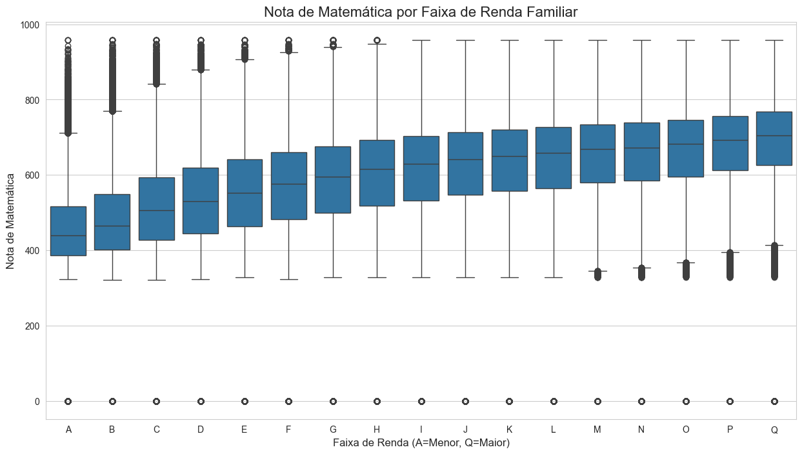

# Análise de Fatores de Desempenho no ENEM e API de Predição de Notas

## 📖 Visão Geral do Projeto (O "Elevator Pitch")

Este projeto realiza uma análise completa dos microdados do ENEM 2023 para identificar os principais fatores socioeconômicos e demográficos que influenciam o desempenho dos estudantes, com foco na nota de Matemática. O entregável final é uma API RESTful, desenvolvida com Flask, capaz de prever a nota de um aluno com base em seu perfil, demonstrando um ciclo completo de um projeto de ciência de dados, desde a manipulação de dados em larga escala até o deploy de um modelo preditivo. 

## 🎯 Objetivos e Perguntas de Negócio

O projeto foi guiado pelas seguintes questões de negócio: 
* Quais são os principais fatores (socioeconômicos, demográficos, escolares) que influenciam o desempenho dos estudantes no ENEM? 
* É possível construir um modelo de Machine Learning que estime a nota de matemática de um aluno com base em seu perfil? 
* Qual a correlação entre a renda familiar e o desempenho no exame? 
* Alunos de escolas privadas apresentam, em média, um desempenho superior ao de alunos de escolas públicas? 

## 📊 Fontes de Dados

* **Principal:** Microdados do Exame Nacional do Ensino Médio (ENEM) de 2023, disponibilizados pelo Instituto Nacional de Estudos e Pesquisas Educacionais Anísio Teixeira (Inep). 
* **Documentação de Apoio:** Dicionário de Variáveis e documentos auxiliares fornecidos pelo Inep. 

## 🛠️ Metodologia

O projeto foi estruturado seguindo as melhores práticas de um fluxo de trabalho de Ciência de Dados: 
1.  **Coleta e Limpeza de Dados:** Foi utilizada a biblioteca Pandas para processar o grande volume de dados (milhões de linhas), aplicando a técnica de leitura em *chunks* para otimização de memória.  A limpeza envolveu o tratamento de dados ausentes, focando em um subconjunto de dados de participantes presentes em todas as provas.
2.  **Análise Exploratória de Dados (EDA):** Geração de visualizações com Seaborn e Matplotlib para investigar a distribuição das notas e a relação entre as variáveis socioeconômicas e o desempenho, respondendo às perguntas de negócio. 
3.  **Engenharia de Features:** Transformação de variáveis categóricas em um formato numérico utilizando a técnica de One-Hot Encoding (`pd.get_dummies`) para preparar os dados para a modelagem.
4.  **Modelagem e Avaliação:** Treinamento de um modelo de regressão `LightGBM` para prever a nota de matemática. O modelo foi avaliado utilizando as métricas RMSE (Raiz do Erro Quadrático Médio) e R² (Coeficiente de Determinação). 
5.  **Deploy:** O modelo treinado foi salvo e exposto através de uma API RESTful simples construída com o micro-framework Flask, capaz de receber dados de um aluno e retornar a predição da nota. 

## 📈 Resultados e Insights

A análise exploratória revelou insights significativos sobre a desigualdade no desempenho educacional:
* **Impacto da Renda:** Há uma correlação positiva e clara entre a renda familiar (`Q006`) e a nota de matemática. Alunos de famílias com maior renda tendem a ter um desempenho substancialmente melhor.
* **Impacto do Tipo de Escola:** A disparidade de desempenho entre escolas públicas e privadas é gritante. A mediana das notas de alunos de escolas privadas é superior ao terceiro quartil (75%) dos alunos de escolas públicas.

## 📁 Estrutura do Repositório

O projeto está organizado da seguinte forma para facilitar a navegação e reprodutibilidade:

├── app/                  # Contém o código da API Flask (app.py)
├── data/                 # Destinado aos dados (ignorado pelo .gitignore)
├── models/               # Contém o modelo treinado (.joblib) e as colunas do modelo
├── notebooks/            # Notebooks Jupyter com a exploração, limpeza e modelagem
├── .gitignore            # Arquivo para ignorar arquivos e pastas (como /data e /venv)
├── README.md             # Este arquivo
├── requirements.txt      # Lista de dependências do projeto
└── test_api.py           # Script para testar a API localmente

## 🚀 Como Usar/Replicar

Para executar este projeto localmente, siga os passos abaixo: 

1.  **Pré-requisitos:** Python 3.9+ e Git instalados. 
2.  **Clone o repositório:**
    `git clone https://github.com/SEU-USUARIO/SEU-REPOSITORIO.git`
3.  **Crie e ative um ambiente virtual:**
    `python -m venv venv`
    `source venv/bin/activate` (ou `.\venv\Scripts\activate` no Windows)
4.  **Instale as dependências:**
    `pip install -r requirements.txt` 
5.  **Execute os notebooks:** Os notebooks na pasta `/notebooks` contêm todo o processo de análise e modelagem.
6.  **Execute a API:** 
    `python app/app.py`
7.  **Teste a API:** Em outro terminal, execute o script de teste:
    `python test_api.py`

## 💻 Tecnologias Utilizadas

* Python
* Pandas
* Scikit-learn
* LightGBM
* Flask
* Seaborn & Matplotlib
* Jupyter Notebook
* Joblib

## 🤔 Limitações e Próximos Passos

* **Limitações:** O modelo atual utiliza um subconjunto das features disponíveis. Muitas informações do questionário socioeconômico não foram incluídas nesta primeira versão. 
* **Próximos Passos:** 
    * **Feature Engineering Avançada:** Testar outras técnicas de encoding e criar features mais complexas.
    * **Otimização de Hiperparâmetros:** Utilizar técnicas como Grid Search ou Random Search para encontrar os melhores parâmetros para o modelo LightGBM.
    * **Deploy na Nuvem:** Publicar a API Flask em um serviço de nuvem (como Heroku, PythonAnywhere ou AWS) para que ela seja acessível publicamente.
